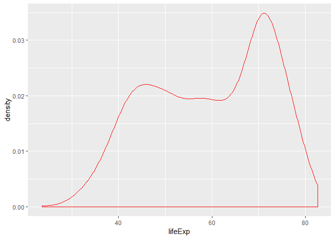
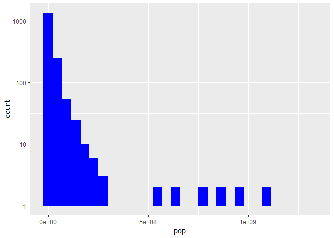
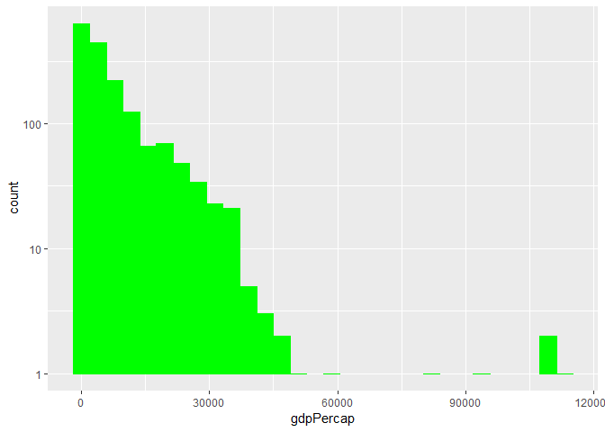
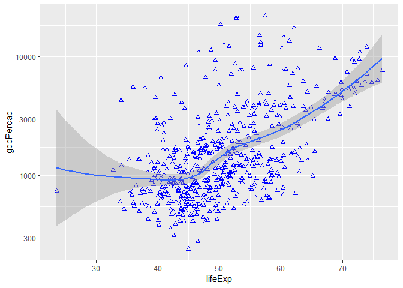
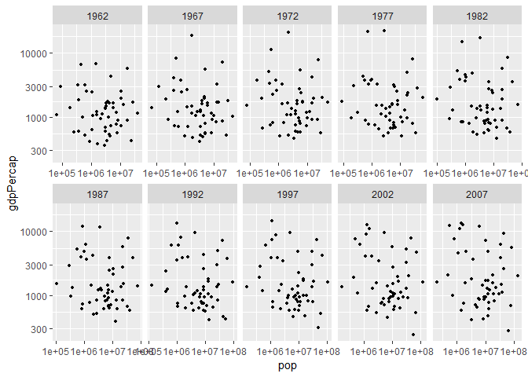
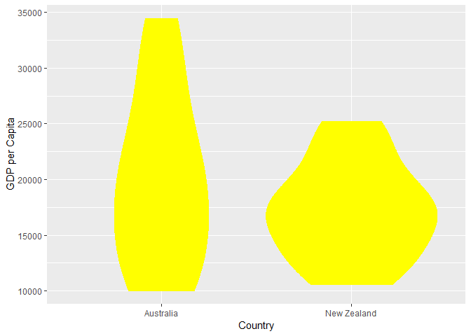
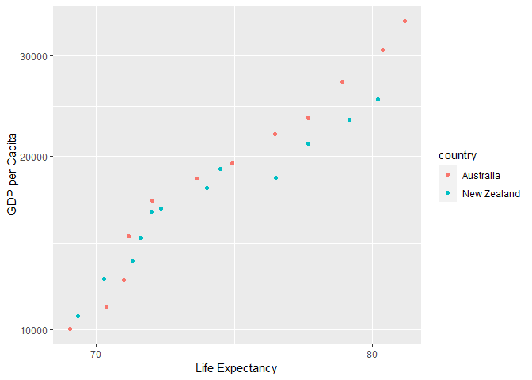
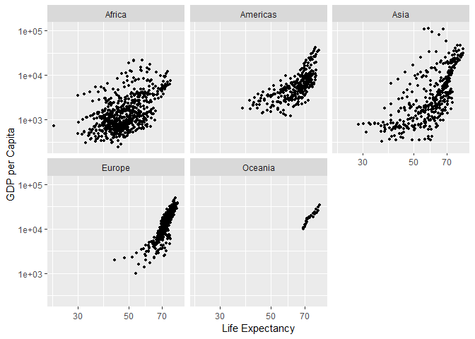

Homework 2
================
Javier Castillo-Arnemann

In this homework assignment we will use `dplyr` and `ggplot2` to explore the `gapminder` dataset.

First, we'll load the data and libraries:

``` r
library(tidyverse)
```

    ## -- Attaching packages ---------------------------------------------------------------------- tidyverse 1.2.1 --

    ## v ggplot2 3.0.0     v purrr   0.2.5
    ## v tibble  1.4.2     v dplyr   0.7.6
    ## v tidyr   0.8.1     v stringr 1.3.1
    ## v readr   1.1.1     v forcats 0.3.0

    ## -- Conflicts ------------------------------------------------------------------------- tidyverse_conflicts() --
    ## x dplyr::filter() masks stats::filter()
    ## x dplyr::lag()    masks stats::lag()

``` r
library(gapminder)
```

Smelling the Data
-----------------

-   Is it a data.frame, a matrix, a vector, a list?

``` r
typeof(gapminder)
```

    ## [1] "list"

We can see that R considers gapminder a list in its internal structure.

-   What is its class?

``` r
class(gapminder)
```

    ## [1] "tbl_df"     "tbl"        "data.frame"

Its class is a tibble, which is a special type of data frame.

-   How many variables/columns?

``` r
ncol(gapminder)
```

    ## [1] 6

It has 6 variables/columns.

-   How many rows/observations?

``` r
nrow(gapminder)
```

    ## [1] 1704

It has 6 rows/observations.

-   Can you get these facts about “extent” or “size” in more than one way? Can you imagine different functions being useful in different contexts?

``` r
dim(gapminder)
```

    ## [1] 1704    6

The `dim()` function also works for this purpose, and would be more suitable if we wanted both the number of rows and columns at the same time.

-   What data type is each variable?

``` r
sapply(gapminder, typeof)
```

    ##   country continent      year   lifeExp       pop gdpPercap 
    ## "integer" "integer" "integer"  "double" "integer"  "double"

Exploring an individual variable
--------------------------------

-   What are possible values (or range, whichever is appropriate) of each variable? For country, the possible values are:

``` r
summary(gapminder)
```

    ##         country        continent        year         lifeExp     
    ##  Afghanistan:  12   Africa  :624   Min.   :1952   Min.   :23.60  
    ##  Albania    :  12   Americas:300   1st Qu.:1966   1st Qu.:48.20  
    ##  Algeria    :  12   Asia    :396   Median :1980   Median :60.71  
    ##  Angola     :  12   Europe  :360   Mean   :1980   Mean   :59.47  
    ##  Argentina  :  12   Oceania : 24   3rd Qu.:1993   3rd Qu.:70.85  
    ##  Australia  :  12                  Max.   :2007   Max.   :82.60  
    ##  (Other)    :1632                                                
    ##       pop              gdpPercap       
    ##  Min.   :6.001e+04   Min.   :   241.2  
    ##  1st Qu.:2.794e+06   1st Qu.:  1202.1  
    ##  Median :7.024e+06   Median :  3531.8  
    ##  Mean   :2.960e+07   Mean   :  7215.3  
    ##  3rd Qu.:1.959e+07   3rd Qu.:  9325.5  
    ##  Max.   :1.319e+09   Max.   :113523.1  
    ## 

Here we can see the minimum and maximum value for each quantitative variable, and we also see that the categorical variable `continent` has 5 possible values. However, we can't see the total amount of possible values for `country`, so we can do the following:

``` r
length(levels(gapminder$country))
```

    ## [1] 142

Here we see there are 142 possible values for `country`.

-   What values are typical? What’s the spread? What’s the distribution? Etc., tailored to the variable at hand.

``` r
ggplot(gapminder, aes(lifeExp)) +
  geom_density(color = "red")
```



``` r
ggplot(gapminder, aes(pop)) +
  geom_histogram(color = "blue", fill ="blue") +
  scale_y_log10()
```

    ## `stat_bin()` using `bins = 30`. Pick better value with `binwidth`.

    ## Warning: Transformation introduced infinite values in continuous y-axis

    ## Warning: Removed 4 rows containing missing values (geom_bar).



``` r
ggplot(gapminder, aes(gdpPercap)) +
  geom_histogram(color = "green", fill ="green") +
  scale_y_log10()
```

    ## `stat_bin()` using `bins = 30`. Pick better value with `binwidth`.

    ## Warning: Transformation introduced infinite values in continuous y-axis

    ## Warning: Removed 11 rows containing missing values (geom_bar).



We can see that the life expectancy is a little bimodal, where the two most common values are around 45 and 79. For population and life expectancy, we used a logarithmic scale because some values were overwhelmingly common.

Exploring various plot types
----------------------------

We'll work just with Africa from 1960 onwards for the following plots.

Let's see the relationship between Life Expectancy and GDP per capita.

``` r
gapminder_africa <- gapminder %>%
  filter(continent == "Africa") %>%
  filter(year >= 1960)

ggplot(gapminder_africa, aes(lifeExp, gdpPercap)) +
  geom_point(color = "blue", shape = 2) +
  scale_y_log10() +
  geom_smooth()
```

    ## `geom_smooth()` using method = 'loess' and formula 'y ~ x'



There seems to be a positive correlation between these two variables.

We can also check if there's a relationship between population and GDP per capita, and do it for every measured year.

``` r
ggplot(gapminder_africa) +
  facet_wrap(~ year, scales = "free_x", ncol = 5) +
  geom_point(aes(pop, gdpPercap), size = 1) +
  scale_y_log10() +
  scale_x_log10()
```



Here, these two variables don't appear to be strongly correlated in any particular year.

For the next plots, we'll only use data from Oceania. First, we'll check the distribution of the GDP per capita in each country.

``` r
gapminder %>%
  filter(continent == "Oceania") %>%
  ggplot(aes(country, gdpPercap)) +
  geom_violin(color = "yellow", fill = "yellow") +
  xlab("Country") +
  ylab("GDP per Capita")
```



We can also check the correlation between GDP per capita and life expectancy, and separate both countries by color.

``` r
gapminder %>%
  filter(continent == "Oceania") %>%
  ggplot(aes(lifeExp, gdpPercap)) +
  geom_point(aes(color = country)) +
  scale_y_log10() +
  scale_x_log10() +
  xlab("Life Expectancy") +
  ylab("GDP per Capita")
```



Here we can see again a very strong correlation between GDP per capita and Life Expectancy.

Finally, we can check is this trend happens in every continent, first arranging the data frame by year so we also have a chronological order.

``` r
arrange(gapminder, year) %>%
  ggplot(aes(lifeExp, gdpPercap)) +
  facet_wrap(~ continent) +
  geom_point(size = 1) +
  scale_y_log10() +
  scale_x_log10() +
  xlab("Life Expectancy") +
  ylab("GDP per Capita")
```



Here we see that the trend looks the same on all continents, although the correlation is not as strong in every continent.

Wanting to do more
------------------

Evaluate this code and describe the result. Presumably the analyst’s intent was to get the data for Rwanda and Afghanistan. Did they succeed? Why or why not? If not, what is the correct way to do this?

``` r
filter(gapminder, country == c("Rwanda", "Afghanistan"))
```

    ## # A tibble: 12 x 6
    ##    country     continent  year lifeExp      pop gdpPercap
    ##    <fct>       <fct>     <int>   <dbl>    <int>     <dbl>
    ##  1 Afghanistan Asia       1957    30.3  9240934      821.
    ##  2 Afghanistan Asia       1967    34.0 11537966      836.
    ##  3 Afghanistan Asia       1977    38.4 14880372      786.
    ##  4 Afghanistan Asia       1987    40.8 13867957      852.
    ##  5 Afghanistan Asia       1997    41.8 22227415      635.
    ##  6 Afghanistan Asia       2007    43.8 31889923      975.
    ##  7 Rwanda      Africa     1952    40    2534927      493.
    ##  8 Rwanda      Africa     1962    43    3051242      597.
    ##  9 Rwanda      Africa     1972    44.6  3992121      591.
    ## 10 Rwanda      Africa     1982    46.2  5507565      882.
    ## 11 Rwanda      Africa     1992    23.6  7290203      737.
    ## 12 Rwanda      Africa     2002    43.4  7852401      786.

Yes, it is a correct way of doing this, because the `c()` function in R creates a vector that filter can read as an argument.
